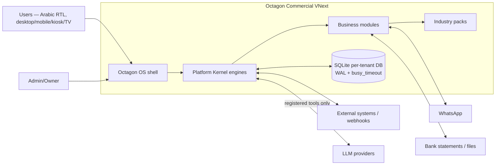
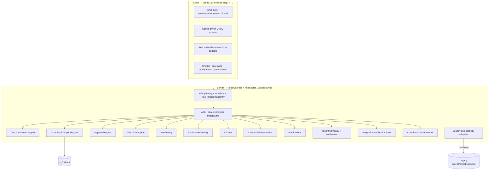

# Octagon VNext — Target Architecture
Authority level 4. Defers to Executive Blueprint (1) and Donor Forensic/License (2). This is the engineering keystone: engines, boundaries, security, extension, deployment, compatibility.

**Binding owner decision O-10 (2026-07-18):** the product is online-first, real-time, cross-platform, PWA-installable, and deployable hosted, privately, over LAN, or locally. The connected server is authoritative; offline behavior is selective and controlled. The full client/connectivity contract is in [`OCTAGON_VNEXT_CONNECTIVITY_AND_CLIENT_ARCHITECTURE.md`](OCTAGON_VNEXT_CONNECTIVITY_AND_CLIENT_ARCHITECTURE.md).

## 1. System context

Online-first: the server is authoritative whenever connected and all client classes use the responsive browser/PWA shell. Local single-server SQLite, LAN, private-server, and hosted PostgreSQL deployments share the same business engines behind a database-adapter boundary. LLMs are optional and reached only through the AI tool layer. Offline is limited to classified workflows with durable outbox and sync controls; it is not full-database multi-master.

## 2. Container / component view

**Rule:** all writes pass `api → aclm (permission + scope) → engine → audit`. No route bypasses ACL. No module writes a ledger directly; it calls the ledger engine.

## 3. The 20 platform engines (kernel)
Each engine spec = Purpose · Entities · Invariants · Services · Events · Permissions · UI · Audit · Migration · Donor · Why-platform. Condensed here; each becomes an epic in the roadmap.

### 3.1 Immutable GL engine  (donor: ERPNext, clean-room)
- **Entities:** `gl_entry`(append-only: id, company, posting_date, account, debit, credit, party_type, party, voucher_type, voucher_no, dims JSON, is_cancelled, created_at), `fiscal_period`(open/closed/locked), `account`(chart), `dimension`+`dimension_value`.
- **Invariants:** every posting balances (Σdebit=Σcredit) per voucher; rows never updated/deleted; corrections = reversing voucher; no posting into a locked period; voucher is polymorphic (any source doc).
- **Services:** `post(voucher, lines, dims)`, `cancel(voucher)` (auto-reverse), `repost(scope)`, `trialBalance(asOf, dims)`, `ledger(account, range)`.
- **Events:** `gl.posted`, `gl.cancelled`. **Permissions:** `finance:gl:post|cancel|view` + dimension scoping. **Audit:** every post/cancel. **Why platform:** every module that touches money posts here — one source of truth, one reconciliation.

### 3.2 Immutable stock ledger engine  (ERPNext, clean-room)
- **Entities:** `stock_ledger_entry`(append-only: item, warehouse, qty, valuation_rate, batch, serial, voucher ref, posting_date), `bin`(materialized cache: qty/valuation per item×warehouse), `batch`, `serial`.
- **Invariants:** append-only; `bin` derived (rebuildable via repost); valuation method per item (moving-avg default, FIFO optional); negative-stock policy configurable.
- **Services:** `move(entries)`, `balance(item, warehouse, asOf)`, `valuation(item)`, `repostValuation(scope)`. **Why platform:** inventory, manufacturing, POS, procurement all move stock through one ledger.

### 3.3 Document-state engine  (NocoBase idea, generalized)
- **Entities:** `doc_state_def`(entity→states[]+transitions[]+guards), `doc_state`(entity, record_id, state, changed_by, at).
- **Invariants:** transitions only along defined edges; guards (permission, field-complete, approval) enforced server-side; draft→submitted→(posted|cancelled) baseline; posting hooks fire on submit.
- **Why platform:** invoices, orders, POs, WOs, tickets all share submit/cancel/approve semantics — define once, configure per entity.

### 3.4 Universal approval engine + Approval Center  (RuoYi bpm, MIT)
- **Entities:** `approval_request`(entity, record_id, action, payload, requester, chain[], current_step, status), `approval_policy`(entity+condition→approver roles, limits, escalation, delegation), `approval_step`(approver, decision, comment, at).
- **Invariants:** requested action does not execute until fully approved; maker≠checker enforceable; amount-limit authority; delegation/substitution; escalation on timeout; withdraw/return-for-revision.
- **UI:** Approval Center inbox — initiated-by-me / pending-my-approval / completed / cc-to-me / delegated / escalated / withdrawn / rejected / returned.
- **Why platform:** one inbox and one policy engine for finance, procurement, HR, AI writes.

### 3.5 Workflow/automation engine  (NocoBase + RuoYi)
- Trigger (record created/updated w/ condition · schedule/cron · manual · webhook) + sequential nodes (condition · update/create record · request-approval · notify · HTTP · JS-sandboxed · delay). Versioned defs + run log. **Why platform:** business rules configurable without code.

### 3.6 ACL + row-level security engine  (NocoBase acl + RuoYi data-permission)
- **Model:** role × action × **data-scope(all/own/dept/company)** × **field-level** × **menu**. Multi-role per user + runtime switch; union. Backend enforcement = predicate injection into every `list/read` query (scope → SQL WHERE) + field masking on serialize.
- **Invariant:** front-end hiding is UX only; the server is the authority. **Why platform:** enterprise sales require provable backend enforcement.

### 3.7 Schema/collection registry + config-CRUD engine  (NocoBase + IDURAR, clean-room)
- **Entities:** `collection`(entity meta), `field`(interface vs storage-type split, options, associations), `entity_registry.json`. Server exposes uniform REST (`/api/x/:entity/...`) per registered collection; client renders list/detail/form/actions from config. **Why platform:** hundreds of consistent screens from config, not hand-code.

### 3.8 Custom-field + snapshot engine  (Aureus fields + NocoBase snapshot)
- Runtime admin-defined fields merged into any entity's form/table/serialize (stored in `data.custom{}`); **snapshot fields** freeze related data at transaction time (price/address/tax on an order line — immutable once posted). **Why platform:** configurability + historical correctness.

### 3.9 Record-history + audit engine  (NocoBase)
- `audit`(entity, record_id, user, action, before, after, at) written by CRUD/engine hooks; per-record history view; global audit log (extends existing `aiAuditLog`). Separate "change history" (data) from "security audit" (who/when/what). **Invariant:** every sensitive action is audited and immutable.

### 3.10 Chatter/collaboration engine  (Aureus, MIT)
- `chatter`(entity, record_id, kind[message|log|activity], body, author, activity_type, due, done), `followers`. Message thread + log notes + scheduled activities + @mentions + attachments + follower notifications on any record. **Why platform:** the daily-use fabric across all modules.

### 3.11 Saved-view + worklist engine  (Aureus, MIT)
- `view`(user/shared, entity, filter+columns config); worklist = named cross-entity query surfaced as a nav item (Orders-to-Invoice, PO-to-Receive, Overdue-Activities, Payments-to-Reconcile, Jobs-Waiting-Material, Inspections-Pending). **Why platform:** turns the ERP into next-action queues, not menus.

### 3.12 Numbering engine  (NocoBase sequence + IDURAR)
- Atomic `nextSeq(company, key)` (BEGIN IMMEDIATE), pattern `{PREFIX}-{company}-{YYYY}{MM}-{#####}`, per-company/per-fiscal-year counters, gap policy, offline-safe. **Invariant:** no duplicate document numbers under concurrency.

### 3.13 Notification center  (RuoYi + NocoBase)
- In-app inbox + templates; channels in-app / WhatsApp (existing) / email/SMS (later). Followers + approval events + workflow notifications converge here.

### 3.14 Pricing/promotion engine  (ERPNext, clean-room)
- `pricing_rule`(priority, conditions: item/group/party/qty/date → discount/price/free-item), `promotion`, `coupon`, `price_list`. Called by quotes/orders/POS. Pure/deterministic.

### 3.15 Subscription/recurring-billing engine  (ERPNext, clean-room)
- `subscription`(plan, party, interval, trial, proration), cron generates invoices via document-state + GL. Dunning ladder on overdue.

### 3.16 Depreciation/asset engine  (ERPNext, clean-room)
- `asset`, `depreciation_schedule`(SL/DD/WDV/manual, per-book, shift factor); monthly posting to GL; capitalization from stock+services.

### 3.17 Report/dashboard designer  (RuoYi + NocoBase data-viz)
- Saved query (entity+filters+groupby+agg) → table/chart widget; dashboard grid persisted; big-screen mode for TV; export via import/export center.

### 3.18 Integration/webhook engine + credential vault  (RuoYi + NocoBase)
- Outbound webhooks on events; inbound API keys; encrypted credential store; API gateway with idempotency/rate-limit/signature (RuoYi `starter-protection` concept).

### 3.19 Tenant/company + entitlement engine  (RuoYi tenant + NocoBase multi-app)
- `company`/`branch` scoping on every table (`company_id`); optional `tenant_id` for SaaS; edition/feature-flag gating; license activation/trial. **Invariant:** cross-company data never leaks (row-level scope + entitlement).

### 3.20 AI tool + approval-control layer  (Octagon existing + governance)
- Every AI write = registered tool with: risk class, permission check, precondition validation, preview, idempotency, approval policy (→3.4), audit event, compensating action. Read-only copilots + NL reporting unrestricted; writes always gated. **Invariant:** AI never bypasses deterministic accounting/inventory/payroll/authorization.

### + Migration/compatibility engine  (see Clone & Migration Plan)
Adapters: `LegacyPayrollAdapter` (read-only over frozen payroll/timesheet), `LegacyFinanceBridge` (post through v6 while mirroring x_gl), `LegacyEntityAdapter` (omni/localStorage → collections). Idempotent backfills.

## 4. Data ownership & boundaries
- **Kernel owns:** x_* tables (gl, stock_ledger, bin, chatter, approvals, audit, views, custom_fields, acl, sequences, notifications, workflow, companies/entitlements).
- **Modules own:** their document tables (invoice, sales_order, purchase_order, work_order, ticket…) but **never** ledger tables — they post via engines.
- **Frozen legacy owns:** employee/timesheet/attendance/payroll — VNext reads via adapter, writes never.
- Each table carries `company_id` (and `tenant_id` in SaaS) from R1; every list/read is scope-injected.

## 5. Security model
Auth (local + optional SSO/OIDC/SAML later) → session → role set → per-request ACL middleware resolves (action permission + data scope + field mask) → engine → audit. Secrets in vault, never client JS (existing server-side AI key proxy pattern continues). Rate-limit/idempotency/signature at gateway. Row-level scope is DB-enforced.

## 6. Extension model
Module = registered package (lifecycle: register → load(no DB writes) → install(first enable, migrations) → enable/disable → remove), self-gated on entitlement, contributes: collections, engines-usage, nav entries, workflows, reports, permissions. Industry packs are modules that add models/workflows/terminology/defaults over the core. Marketplace later.

## 7. Deployment model
- **Hosted SaaS multi-tenant** — R8/GA; PostgreSQL adapter and tenant isolation.
- **Private server** (self-hosted multi-user) — R8/GA; same responsive PWA client.
- **Local network** (LAN multi-user, one server) — R1 foundation and R10 packaging.
- **Local single-server** (including SQLite-local edition) — R10 packaging; supported, not the default product identity.
Same codebase; deployment differs by config/entitlement, not forked code.

## 8. Compatibility layer (summary; full in Clone & Migration Plan)
Read-through adapters for frozen domains; dual-write finance during transition with reconciliation gate; idempotent backfills for omni/localStorage; per-tenant cutover with rollback = pointer switch (production never mutated).

## 9. Non-negotiable architectural invariants (the "constitution")
1. Ledgers append-only; corrections via reversal. 2. Server is the permission authority (row+field). 3. Every sensitive action audited. 4. No module writes another module's ledger. 5. Numbering atomic + unique per company/year. 6. Frozen payroll/timesheet never mutated by VNext. 7. AI writes always registered+gated+audited. 8. Configuration over per-customer forks. 9. `company_id` scope on every business row. 10. Arabic-first, RTL-safe, online-first, real-time, cross-platform, with selective offline resilience.
